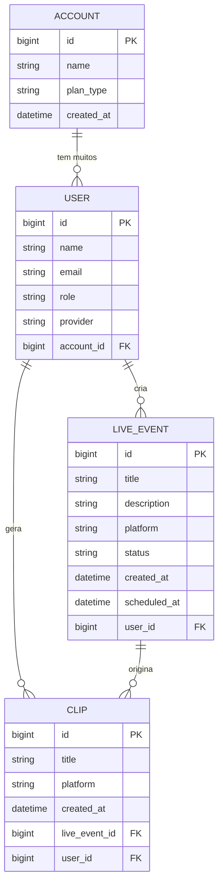

O **StreamTools** é um backend moderno desenvolvido com **Java 17 + Spring Boot 3**, focado no gerenciamento de:

- Criadores de conteúdo  
- Eventos ao vivo (Lives)  
- Clips  
- Contas & usuários associados  

Ideal como base para dashboards, plataformas de streaming, sistemas de creator economy e ferramentas de analytics.

---

# 🚀 **Tecnologias Utilizadas**

- **Java 17**
- **Spring Boot 3**
  - Spring Web
  - Spring Data JPA
  - Validation
- **MySQL 8**
- **Hibernate ORM**
- **Lombok**
- **Maven**
- **HikariCP (connection pool)**

---

# 📂 **Estrutura do Projeto**

```md
src/main/java/com.streamtools
 ├── domain
 │    ├── model
 │    │     ├── Account.java
 │    │     ├── User.java
 │    │     ├── LiveEvent.java
 │    │     └── Clip.java
 │    ├── enums
 │    └── repository
 │
 ├── web
 │    └── controller
 │         └── LiveEventController.java
 │
 └── StreamtoolsApplication.java
````

---

# 🗄 **Modelo de Dados (ER Diagram)**



---

# ⚙️ **Configuração do Banco de Dados**

Arquivo `application.properties`:

```properties
spring.datasource.url=jdbc:mysql://localhost:3306/streamtools
spring.datasource.username=usuario
spring.datasource.password=senha

spring.jpa.hibernate.ddl-auto=update
spring.jpa.show-sql=true
spring.jpa.properties.hibernate.format_sql=true
```

---

# 📡 **Endpoints REST**

## 🎬 **Lives**

### ▶️ GET — listar todas as lives

```
GET /api/lives
```

### ⬆️ POST — criar nova live

```json
{
  "title": "Primeira Live",
  "description": "Live de teste",
  "platform": "TWITCH",
  "status": "PLANNED",
  "scheduledAt": "2025-01-01T20:00:00"
}
```

---

# ▶️ **Como Rodar o Projeto**

### 1. Clonar o repositório

```bash
git clone https://github.com/seu-usuario/streamtools.git
```

### 2. Acessar o projeto

```bash
cd streamtools
```

### 3. Rodar com Maven

```bash
mvn spring-boot:run
```

### 4. Testar a API

```
http://localhost:8080/api/lives
```
